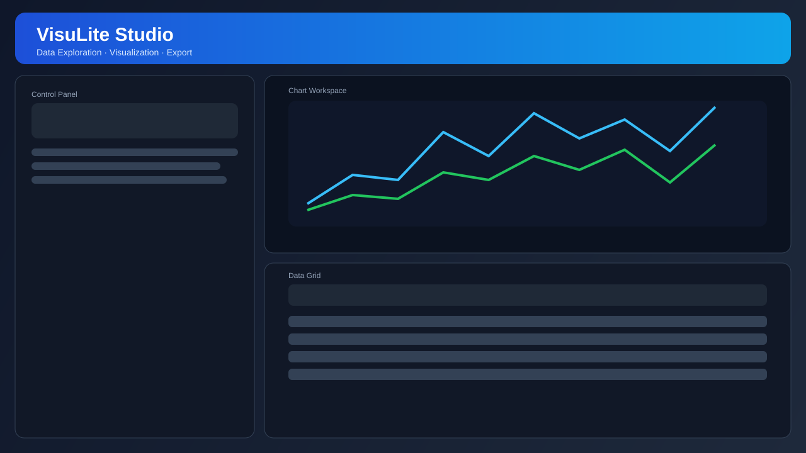

<div align="center">

# VisuLite Studio

**A modern desktop analytics studio for fast, local, business-grade data visualization.**

<p>
  <a href="./LICENSE"></a>
  
  
  
  
  
</p>



</div>

---

## Overview

VisuLite Studio is a production-oriented desktop app for teams that need to:

- load structured files quickly
- explore and clean data interactively
- build high-quality charts
- export visual results for reports and presentations
- do all of that locally without a backend service

It is designed for speed, clarity, and operational usability.

## Why VisuLite

- Local-first: no server dependency, no cloud lock-in.
- Business-ready UX: command bar, quick actions, layout memory, focus mode.
- End-to-end workflow: ingest -> preprocess -> visualize -> export.
- Low learning curve: spreadsheet users can use it in minutes.

## Feature Highlights

### Data Ingestion

- CSV / TSV / Excel (`.xlsx`, `.xls`) / JSON support
- Drag-and-drop loading
- Recent file history and command-bar quick reopen
- Encoding fallback for robust CSV/TSV loading

### Data Preparation

- Text filter and numeric range filter
- Missing-value handling (`mean`, `median`, `zero`, `ffill`, `bfill`)
- Column type conversion (`string`, `int`, `float`, `datetime`)
- Row slicing for fast exploration
- Undo / Redo for data operations (`Ctrl+Z`, `Ctrl+Y`, `Ctrl+Shift+Z`)

### Visualization

- Line, Bar, Scatter, Histogram, Boxplot, Heatmap
- Theme switching (default / seaborn / ggplot / etc.)
- Custom line style, marker style, color strategy
- Legend and grid controls

### Export & Batch

- PNG / JPG / SVG / PDF export
- Configurable DPI and figure size
- Filename template support
- Batch plotting for folders

### Productivity UX

- Global table search (`Ctrl+F`)
- Sidebar toggle (`Ctrl+B`)
- Chart focus mode (`Ctrl+2`)
- Restore balanced layout (`Ctrl+1`)
- Persistent UI preferences (split layout, mode, theme)
- Edit history controls in menu with keyboard accelerators

## Keyboard Shortcuts

| Shortcut | Action |
|---|---|
| `Ctrl+O` | Open data file |
| `Ctrl+S` | Save chart config |
| `Ctrl+E` | Export chart |
| `Ctrl+Z` | Undo last data operation |
| `Ctrl+Y` / `Ctrl+Shift+Z` | Redo last data operation |
| `Ctrl+Shift+E` | Quick export PNG |
| `Ctrl+F` | Focus global table search |
| `Ctrl+B` | Toggle sidebar |
| `Ctrl+2` | Toggle chart focus mode |
| `Ctrl+1` | Restore default layout |
| `F5` / `Enter` | Update chart |
| `F1` | Show shortcuts help |
| `Ctrl+Q` | Exit |

## Architecture

```text
visulite/
  app.py                  # app bootstrap
  common/
    logging.py            # logging setup
  models/                 # state/config models
  services/               # data loading, processing, plotting, export
  ui/                     # main window, widgets, styles
main.py                   # entrypoint
tests/                    # unit/regression tests
```

## Quick Start

### 1) Environment

```powershell
D:/tools/miniconda3/Scripts/activate
conda activate visulite
```

### 2) Install dependencies

```powershell
pip install -r requirements.txt
```

### 3) Run app

```powershell
python main.py
```

## Testing

```powershell
python -m unittest discover -s tests -p "test_*.py"
```

## Packaging

```powershell
pyinstaller VisuLite.spec
```

Build output:

- `dist/VisuLite/`

## Roadmap

- [x] Modern command-bar shell and KPI badges
- [x] Global table search and layout focus mode
- [x] Heatmap/colorbar rendering regressions fixed
- [x] Regression tests for critical services
- [ ] Plugin-based data connectors (SQL/API)
- [ ] Project/session management
- [ ] Internationalization package (EN/ZH)
- [ ] CI pipeline with release artifacts

## Contributing

Issues and PRs are welcome.

1. Fork the repo
2. Create a feature branch
3. Add or update tests
4. Open a pull request with a clear change summary

See `CONTRIBUTING.md` for full local workflow and contribution standards.

## Changelog

User-visible changes are tracked in `CHANGELOG.md` under `Unreleased`.

## License

MIT License. See `LICENSE` for details.

